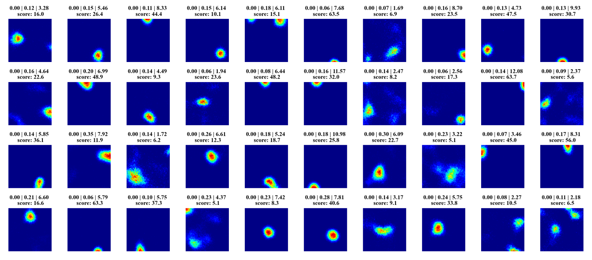
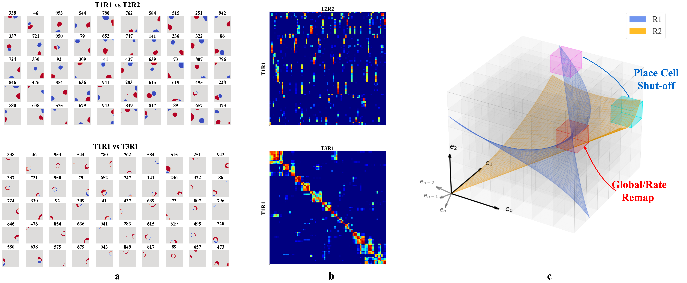

# Place Cells Episodic RNN
### Official Implementation of:
> Z. Wang*, R. W. Di Tullio*, S. Rooke, and V. Balasubramanian. Time Makes Space: Emergence of Place Fields in Networks Encoding Temporally Continuous Sensory Experiences. In *NeurIPS 2024*.

## About the Project

Decades of research have shown that animals encode locations using place cells, neurons that represent very specific positions. This encoding resembles a one-hot or few-hot representation of spatial locations. Place cells also respond to context, such as environments with distinct visual, auditory, or olfactory cues, and they can reshuffle in new environments while preserving stable spatial representations of previous rooms. The precise network mechanism underlying this encoding remains unknown. In this study, we use a recurrent autoencoder to model the place-cell encoding process. We show that, by learning to autoencode temporally continuous sensory experiences, the network naturally develops place cell-like representations. These emergent representations can remap across environments and encode multiple rooms without catastrophic forgetting. Detailed results can be found in the [project page](https://zhaozewang.github.io/tms/).

<p align="center">
<picture></picture>
</p>

Key findings:
- **Emergent spatial coding**: Place-like units emerge naturally from reconstructive memory objectives
- **Remapping behavior**: Networks form distinct spatial maps for different environments and recover previous maps when revisiting familiar spaces  
- **Stable representations**: Spatial maps remain stable over extended periods with only gradual drift
- **Multi-dimensional spaces**: The approach extends to 3D and higher-dimensional abstract spaces

<p align="center">
<picture></picture>
</p>

<p align="center">
<picture></picture>
</p>

## Running the code
### Virtual Environment
#### Create a new conda environment
```bash
conda create -n place-rae python=3.10
conda activate place-rae
```

#### Install `nn4n`
```bash
cd <project_root>
pip install -e .
```

### Trajectories
The trajectories were originally generated using a privately maintained simulation code base. We’ll release a minimal reproducible version of that simulation later. For now, the trajectory generation step is replaced with pre-generated trajectories stored in the `trajectories` folder, which can be found at [Trajectories Google Drive](https://drive.google.com/drive/folders/1Dk9dzgiGq4DXhHyLSZN_vx8Ct8sudUxU?usp=drive_link).

### Data Structure
```bash
<project_root>/
├── trajectories/
│   ├── <room_name>/
│   │   ├── traj_<speed>_<boundary_avoidance>.npz
│   │   └── arena_map.npz
│   └── ...
```

We've attached 2 different rooms, a 200x200 pixel^2 (1 pixel = 1 cm) room and a 100x100 pixel^2 room. The `arena_map.npz` file contains the arena map with 1 being the occupied space and 0 being the unoccupied space. 

The `traj_<speed>_<boundary_avoidance>.npz` files contain the trajectories. In this project, we used pre-generated trajectories. However, for an idea of how these trajectories were generated, below are the parameters we used when generating them. We used 3 different speeds: 

``` python
fast_explore = {
    "velocity_mean": 20,
    "velocity_sd": 5,
    "random_drift_magnitude": 0.10,
    "switch_direction_prob": 0.3,
    "switch_velocity_prob": 0.1,
    "avoid_boundary_dist": 30,
    # "avoid_boundary_dist": -1,
}
med_explore = {
    "velocity_mean": 10,
    "velocity_sd": 2,
    "random_drift_magnitude": 0.05,
    "switch_direction_prob": 0.15,
    "switch_velocity_prob": 0.05,
    "avoid_boundary_dist": 10,
    # "avoid_boundary_dist": -1,
}
slow_explore = {
    "velocity_mean": 4,
    "velocity_sd": 1,
    "random_drift_magnitude": 0.02,
    "switch_direction_prob": 0.06,
    "switch_velocity_prob": 0.03,
    "avoid_boundary_dist": 5,
    # "avoid_boundary_dist": -1,
}
```

The parameters `random_drift_magnitude`, `switch_direction_prob`, `switch_velocity_prob` are just empirical settings we used to create more realistic paths. Trajectories ending with the `ba` suffix use boundary avoidance, which smooths direction changes near edges so they don’t “bounce” off boundaries. However, this may lead to under-exploration near the edges, so we also included versions without boundary avoidance (no `ba` suffix). These are simply random traversal trajectories and don’t have any special properties.

Each trajectory file contains a tensor of shape `(B, Ts, 2)` with `B = 128` and `Ts = 2048s`, discretized at `50` ms bins (`2048 / 50 * 1000ms/s = 40960` steps). The last dimension stores the `(x, y)` coordinates of the trajectory, with each `.npz` file containing trajectories long enough to cover the entire arena.

## Training
All training code is in `demo.ipynb`. A pre-trained checkpoint (`latest.pth`) is provided in the `ckpts` folder.

## Related Projects
The RNN used in this project is from [NN4Neurosim](https://github.com/NN4Neurosim/nn4n), a PyTorch-based framework that provides easy-to-use APIs for implementing complex, biologically plausible recurrent networks. For reproducibility, we forked the RNN from the `nn4n` folder. Further details are available in the [NN4Neurosim documentation](https://nn4n.org). 

## Citation
If you find this code or [NN4Neurosim](https://github.com/NN4Neurosim/nn4n) useful in your research, please consider citing the following paper:
```
@inproceedings{
  wang2024time, 
  title={Time Makes Space: Emergence of Place Fields in Networks Encoding Temporally Continuous Sensory Experiences}, 
  author={Zhaoze Wang and Ronald W. Di. Tullio and Spencer Rooke and Vijay Balasubramanian}, 
  booktitle={Proceedings of the 2024 Conference on Neural Information Processing Systems (NeurIPS)}, 
  year={2024}
}
```
