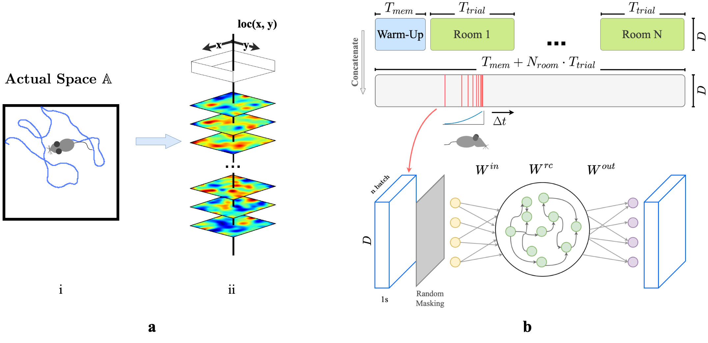

# Place Cells Episodic RNN
*We are still in the process of cleaning up some parts of the codebase. We apologize for the inconvenience that the code might not be fully functional at the moment. Please check back soon for updates.*
### Official Implementation of:
> Z. Wang*, R. W. Di Tullio*, S. Rooke, and V. Balasubramanian. Time Makes Space: Emergence of Place Fields in Networks Encoding Temporally Continuous Sensory Experiences. In *NeurIPS 2024*.

In this paper, we model the hippocampal CA3 area as a recurrent autoencoder designed to recall and reconstruct sensory experiences from noisy, partial cues in simulated environments. By training the model with agents navigating realistic trajectories through spatially smoothed sensory maps, we demonstrate that imposing an activity constraint during training results in the emergence of spatially localized firing fields, resembling place cells, in the encoding layer.

## Running the code
### Dependencies
#### NN4Neurosim
The RNN used in this project is from [NN4Neurosim](https://github.com/NN4Neurosim/nn4n), the documentation can be found [here](https://nn4n.org).


## About the Project
#### A Recurrent Autoencoder Model of Episodic Memory Storage
Inspired by the classic episodic memory theory of the hippocampus, suggest that the hippocampus stores sensory experiences gathered during their spatial navigation. Testing this, we first simulate the rodent movement in a 2D environment. An illustration of the trajectory is shown below.
<p align="center">
<picture></picture>
</p>
Then, at any given moment, the agent receives a location-specific sensory response, which we defined as experience vectors. A sequence of such experience vectors thus forms animal's sensory perception of the environment. We then concatenated timesteps sampled from a decaying distribution of recent experiences into 'episodic bouts'. We use these 'episodic bounts' to train a recurrent autoencoder (RAE) to model the memory storage process of the CA3.
<p align="center">
<picture></picture>
</p>

#### Emerging Place Cells
We observed the emergence of place cells in the encoding layer of the RAE.
<p align="center">
<picture></picture>
</p>

#### Remapping and the Reversion of Place Fields After Remapping
Our model replicates the characteristic remapping behavior of the place cells.
<p align="center">
<picture></picture>
</p>

#### Place Cells as Memory Cells Predicts Place Fields in Higher-Dimensional and/or Abstract Spaces
We also predict the place fields in 3D space or higher-dimensional abstract spaces.
<p align="center">
<picture></picture>
</p>

#### Orthogonal Representations of Different Rooms and Stability of Spatial Representations Across Remapping
The model forms orthogonal representations for distinct environments, with place fields remaining stable across different environments over extended periods. The figure below illustrates the gradual drift of a single place field within the same room over 30 cycles. The RAE is trained for 20 10-minute trials between consecutive cycles, demonstrating the stability of place fields within the same environment.
<p align="center">
<picture></picture>
</p>


## Citation
If you find this code or [NN4Neurosim](https://github.com/NN4Neurosim/nn4n) useful in your research, please consider citing the following paper:
```
@inproceedings{
  wang2024time, 
  title={Time Makes Space: Emergence of Place Fields in Networks Encoding Temporally Continuous Sensory Experiences}, 
  author={Zhaoze Wang and Ronald W. Di. Tullio and Spencer Rooke and Vijay Balasubramanian}, 
  booktitle={Proceedings of the 2024 Conference on Neural Information Processing Systems (NeurIPS)}, 
  year={2024}
}
```
